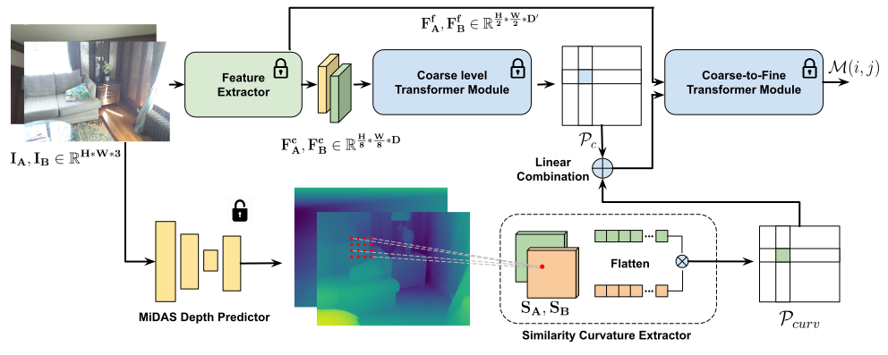

# [ICCV 2023] [Guiding Local Feature Matching with Surface Curvature](https://openaccess.thecvf.com/content/ICCV2023/papers/Wang_Guiding_Local_Feature_Matching_with_Surface_Curvature_ICCV_2023_paper.pdf)
[Shuzhe Wang](https://scholar.google.com/citations?user=Kzq9fl4AAAAJ&hl=en&oi=ao), [Juho Kannala](https://scholar.google.com/citations?user=c4mWQPQAAAAJ&hl=en), [Marc Pollefeys](https://scholar.google.com/citations?user=YYH0BjEAAAAJ&hl=en), [Daniel Barath](https://scholar.google.com/citations?user=U9-D8DYAAAAJ&hl=en)

We propose a new method, called curvature similarity extractor (CSE), for improving local feature matching across images. CSE calculates the curvature of the local 3D surface patch for each detected feature point in a viewpoint-invariant manner via fitting quadrics to predicted monocular depth maps. This curvature is then leveraged as an additional signal in feature matching with off-the-shelf matchers like SuperGlue and LoFTR. Additionally, CSE enables end-to-end joint training by connecting the matcher and depth predictor networks. Our experiments demonstrate on large-scale real-world datasets that CSE consistently improves the accuracy of state-of-the-art methods. Fine-tuning the depth prediction network further enhances the accuracy. The proposed approach achieves state-of-the-art results on the ScanNet dataset, showcasing the effectiveness of incorporating 3D geometric information into feature matching.



## Environment

Our curvature similarity extractor is an add-on component for advanced matchers. Here we consider the [QuadTree](https://github.com/Tangshitao/QuadTreeAttention) as the matcher and [DPT](https://github.com/isl-org/DPT) for the depth estimation. Please consider setup the [QuadTree](https://github.com/Tangshitao/QuadTreeAttention) environment with the following commands:

```
git clone git@github.com:Tangshitao/QuadTreeAttention.git
cd QuadTreeAttention&&python setup.py install
```

Download our CSE module and setup the environment with the following commands.

```
cd ..
git clone git@github.com:AaltoVision/surface-curvature-estimator.git
cd surface-curvature-estimator
conda env create -f environment.yaml
conda activate 
```

## Dataset

For [Megadepth](https://www.cs.cornell.edu/projects/megadepth/) and [ScanNet](https://github.com/ScanNet/ScanNet#scannet-data) datasets, please refer to the [LoFTR](https://github.com/zju3dv/LoFTR) for dataset setup. For [YFCC100M](), you can use the OANet to download it.

```
cd ..
git clone https://github.com/zjhthu/OANet
cd OANet
bash download_data.sh raw_data raw_data_yfcc.tar.gz 0 8
tar -xvf raw_data_yfcc.tar.gz
# YFCC100M
ln -s raw_data/yfcc100m/* /path_to/data/yfcc/test
```

## Evaluation

We provide the evaluation without any model fine-tuning. The batch size is set to 1 to allow single gpu evaluation.  Please consider downloading the models [here](https://drive.google.com/drive/folders/1lUpLCfkZJePPNEgSwS3OKkhIXvx_L5OR?usp=drive_link) and following the commands below for the evaluation. The weights can also be downloaded from the original [QuadTree](https://github.com/Tangshitao/QuadTreeAttention) and [DPT](https://github.com/isl-org/DPT) repos. Note we run the evaluation with and without CSE for a more fair comparison.

```
# For ScanNet
sh scripts/reproduce_test/indoor_ds_quadtree_with_cse.sh
# For MegaDepth
sh scripts/reproduce_test/outdoor_ds_quadtree_with_cse_MEGA.sh
# For YFCC
scripts/reproduce_test/outdoor_ds_quadtree_with_cse_YFCC.sh
```

## Acknowledgements

We appreciate the previous open-source repositories  [QuadTree](https://github.com/Tangshitao/QuadTreeAttention) ,  [LoFTR](https://github.com/zju3dv/LoFTR) , and [DPT](https://github.com/isl-org/DPT) 

## Citation

Please consider citing our papers if you find this code useful for your research:

```
@InProceedings{Wang_2023_ICCV,
    author    = {Wang, Shuzhe and Kannala, Juho and Pollefeys, Marc and Barath, Daniel},
    title     = {Guiding Local Feature Matching with Surface Curvature},
    booktitle = {Proceedings of the IEEE/CVF International Conference on Computer Vision (ICCV)},
    month     = {October},
    year      = {2023},
    pages     = {17981-17991}
}
```